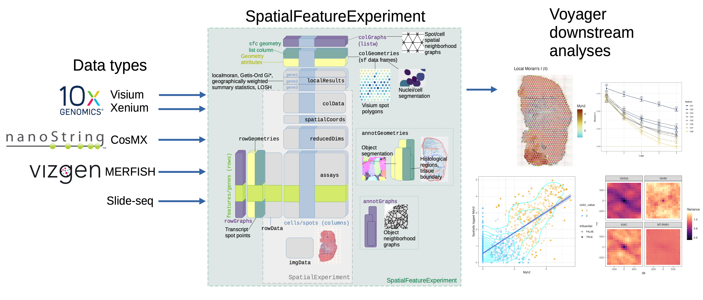

# From geospatial to spatial-omics

<!-- badges: start -->

<!-- badges: end -->

Tobler's first law of geography:

> Everything is related to everything else. But near things are more related than distant things.

In single cell RNA-seq (scRNA-seq), data and metadata can be represented with [`SingleCellExperiment`](https://bioconductor.org/packages/release/bioc/html/SingleCellExperiment.html) or [`Seurat`](https://satijalab.org/seurat/index.html) objects, and basic exploratory data analyses and visualization performed with [`scater`](https://bioconductor.org/packages/release/bioc/html/scater.html), [`scran`](https://bioconductor.org/packages/release/bioc/html/scran.html), and [`scuttle`](https://bioconductor.org/packages/release/bioc/html/scuttle.html), or `Seurat`. The [`SpatialFeatureExperiment`](https://bioconductor.org/packages/devel/bioc/html/SpatialFeatureExperiment.html) package and S4 class extending [`SpatialExperiment`](https://bioconductor.org/packages/release/bioc/html/SpatialExperiment.html) and `SingleCellExperiment` brings EDA methods for vector spatial data to spatial transcriptomics. `Voyager` to `SpatialFeatureExperiment` is just like `scater`, `scran`, and `scuttle` to `SingleCellExperiment`, implementing basic exploratory spatial data analysis (ESDA) and visualization methods. While `Seurat` can perform some spatial analyses, `Voyager` borrows much more broadly from the geospatial tradition, especially from the [`spdep`](https://r-spatial.github.io/spdep/) package, one of the main R packages for spatial dependence analyses.

Non-spatial statistical methods often assume that the samples (cells, spots) are independent, which is not the case in spatial data, where nearby samples tend to be more similar (i.e. positive spatial autocorrelation; negative spatial autocorrelation is when nearby samples tend to be more dissimilar, like a checkered pattern). Much of ESDA is dedicated to spatial autocorrelation, such as finding whether it is present, and if so what's its length scale, and how it may vary locally in space.

Please open a [GitHub issue](https://github.com/pachterlab/Voyager/issues) if you have questions or suggestions or encountered problems with this package.
