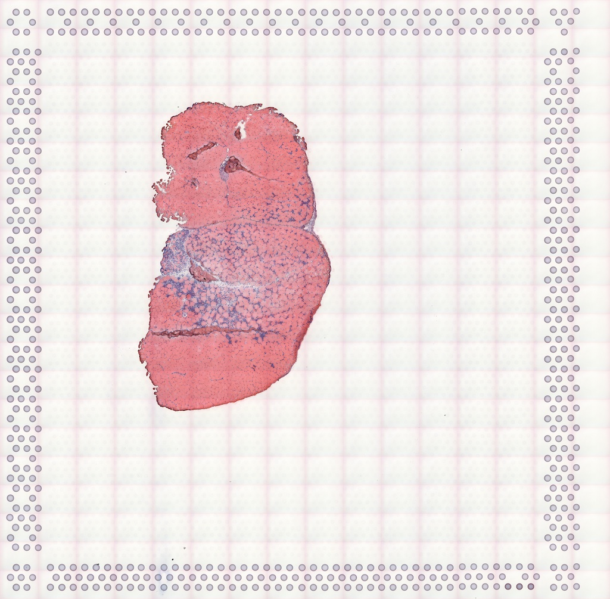

```{r, include = FALSE}
knitr::opts_chunk$set(
  collapse = TRUE,
  comment = "#>"
)
```

# Introduction

Many spatial transcriptomics technologies have been developed, and at present, Visium is by far the most popular technology [@Moses2022-xz]. Hence this introductory vignette uses a Visium dataset to demonstrate a basic exploratory data analysis (EDA) of a spatial transcriptomics dataset.
```{r, echo = FALSE, fig.alt="Bar chart showing the number of institutions using each spatial transcriptomics data collection method. Only methods used by at least 3 different institutions are shown. The bars are colored by category of the methods. 10X Visium (category NGS barcoding) is used by over 100 institutions, far more than any other method. Following Visium are GeoMX DSP and GeoMX WTA (category ROI selection), used by over 20 institutions. 2016 ST and some other ROI selection methods follow, then ISS, then Stereo-seq and slide-seq2 (both NGS barcoding), then a number of smFISH based methods such as Molecular Cartography and MERFISH."}
knitr::include_graphics("https://pachterlab.github.io/LP_2021/04-current_files/figure-html/n-insts-1.png")
```

Here the data is represented in the [`SpatialFeatureExperiment`](https://bioconductor.org/packages/devel/bioc/html/SpatialFeatureExperiment.html) (SFE) format, and `Voyager` is used to perform spatial analysis with methods borrowed from the geospatial field. [`SingleCellExperiment`](https://bioconductor.org/packages/release/bioc/html/SingleCellExperiment.html) (SCE) is a data structure for scRNA-seq, an alternative to the popular `Seurat` package. [`SpatialExperiment`](https://bioconductor.org/packages/release/bioc/html/SpatialExperiment.html) (SPE) is an existing class inheriting from SCE, for spatial -omics data, and SFE inherits from SPE and hence also SCE. As SFE inherits from SCE, non-spatial scRNA-seq EDA methods such as dimension reduction, clustering, and many plotting functions can be applied to SFE. In this vignette, we perform some non-spatial scRNA-seq EDA on the Visium data, and a primer on spatial analysis. See [the ESDA Visium vignette](https://pachterlab.github.io/Voyager/articles/vig2_visium.htil) for a more in depth introduction to univariate spatial analyses on the same dataset. 

Here we load the packages used in this vignette.
```{r setup}
library(Voyager)
library(SpatialFeatureExperiment)
library(SingleCellExperiment)
library(SpatialExperiment)
library(scater)
library(scran)
library(patchwork)
library(bluster)
library(SFEData)
library(BiocParallel)
library(rjson)
library(stringr)
library(ggplot2)
library(sparseMatrixStats)
theme_set(theme_bw(10))
```

# Dataset
## Space Ranger output

The gene count matrix and spot metadata provided by the authors of this dataset actually did not come in the standard Space Ranger output format. However, given the popularity of Visium and Space Ranger, it would be helpful to introduce the Space Ranger output and how to read it into R as an SFE object.

Space Ranger output can be read in a similar manner as in `SpatialExperiment`; the returned SFE object has the `spotPoly` column geometry for the spot polygons. If the filtered matrix (i.e. only spots in tissue) is read in, then a column graph called `visium` will also be present, for the spatial neighborhood graph of the Visium spots on tissue. The graph is not computed if all spots are read in regardless of whether they are on tissue.

```{r}
# Example from SpatialExperiment
dir <- system.file(
  file.path("extdata", "10xVisium"), 
  package = "SpatialExperiment")
  
sample_ids <- c("section1", "section2")
(samples <- file.path(dir, sample_ids, "outs"))
```

The results for each tissue capture are should be in the `outs` directory. Inside the `outs` directory are two directories: `raw_reature_bc_matrix` has the unfiltered gene count matrix, and `spatial` has the spatial information. 

```{r}
list.files(samples[1])
```

The [`DropletUtils`](https://bioconductor.org/packages/release/bioc/html/DropletUtils.html) package has a function `read10xCounts()` which reads the gene count matrix. SPE reads in the spatial information, and SFE uses the spatial information to construct Visium spot polygons and spatial neighborhood graphs. Inside the `spatial` directory:

```{r}
list.files(file.path(samples[1], "spatial"))
```

`tissue_lowres_image.png` is a low re
Inside the `scalefactors_json.json` file:

```{r}
fromJSON(file = file.path(samples[1], "spatial", "scalefactors_json.json"))
```

`spot_diameter_fullres` is the diameter of each Visium spot in the full resolution H&E image in pixels. `tissue_hires_scalef` and `tissue_lowres_scalef` are the ratio of the size of the high resolution (but not full resolution) and low resolution H&E image to the full resolution image. `fiducial_diameter_fullres` is the diameter of each fiducial spot used to align the spots to the H&E image in pixels in the full resolution image.

The `tissue_positions_list.csv` file contains information for the spatial coordinates of the spots and whether each spot is in tissue as automatically detected by Space Ranger or manually annotated in the Loupe browser. If the polygon of the tissue boundary is available, whether from image processing or manual annotation, geometric operations as supported by the SFE package, which is based on the `sf` package, can be used to find which spots intersect with the tissue and which spots are contained in the tissue. Geometric operations can also find the polygons of the intersections between spots and the tissue, but the results can get messy since the intersections can have not only polygons but also points and lines. 

Now we read in the toy data that is in the Space Ranger output format. The `load` argument indicates whether the images should be loaded into memory. The SFE package does not work with the image at present, so `load = FALSE`.

```{r}
(sfe3 <- read10xVisiumSFE(samples, sample_ids, type = "sparse", data = "raw",
                         load = FALSE))
```

Space Ranger output includes the gene count matrix, spot coordinates, and spot diameter. The Space Ranger output does NOT include nuclei segmentation or pathologist annotation of histological regions. Extra image processing, such as with ImageJ and QuPath, are required for those geometries.

## Mouse skeletal muscle dataset
The dataset used in this vignette comes from [Large-scale integration of single-cell transcriptomic data captures transitional progenitor states in mouse skeletal muscle regeneration](https://doi.org/10.1038/s42003-021-02810-x) [@McKellar2021-ek]. Notexin was injected into the tibialis anterior muscle to induce injury, and the healing muscle was collected 2, 5, and 7 days post injury for Visium. The dataset here is from the 2 day timepoint. The dataset was originally not in the Space Ranger output format, but is already in a `SpatialFeatureExperiment` (SFE) object.

The gene count matrix was directly downloaded [from GEO](https://www.ncbi.nlm.nih.gov/geo/query/acc.cgi?acc=GSM4904759). All 4992 spots, whether in tissue or not, are included. The H&E image was used for nuclei and myofiber segmentation. A subset of nuclei from randomly selected regions from all 3 timepoints were manually annotated to train a StarDist model to segment the rest of the nuclei, and the myofibers were all manually segmented. The tissue boundary was found by thresholding in OpenCV, and small polygons were removed as they are likely to be debris. Spot polygons were constructed with the spot centroid coordinates and diameter in the Space Ranger output. The `in_tissue` column in `colData` indicates which spot polygons intersect the tissue polygons, and is based on `st_intersects()`.

Tissue boundary, nuclei, myofiber, and Visium spot polygons are stored as `sf` data frames in the SFE object. See [the vignette of `SpatialFeatureExperiment`](https://bioconductor.org/packages/devel/bioc/vignettes/SpatialFeatureExperiment/inst/doc/SFE.html) for more details on the structure of the SFE object. The SFE object of this dataset is provided in the `SFEData` package. Here we download the data and load it into R.

```{r}
(sfe <- McKellarMuscleData("full"))
```

The authors provided the full resolution hematoxylin and eosin (H&E) image on GEO, which we downsized to more quickly show online. This is what it looks like:
```{r, echo=FALSE, out.width = "100%", fig.alt="A cross section of mouse muscle is slightly off center to the lower left. In the middle of the tissue is the notexin injury site with leukocyte infiltration and fewer myofibers. The rest of the tissue section is tightly packed with myofibers."}

```

# Quality control
## Spots
Here we plot the quality control (QC) metrics both as violin plots and in space. The QC metrics are pre-computed and stored in `colData` (for spots) and `rowData` of the SFE object.

```{r}
names(colData(sfe))
```

Here we plot the total UMI counts per spot. The commented out line of code shows how to compute total UMI counts.
```{r}
# colData(sfe)$nCounts <- colSums(counts(sfe))
violin <- plotColData(sfe, "nCounts", x = "in_tissue", colour_by = "in_tissue") +
    theme(legend.position = "top")
spatial <- plotSpatialFeature(sfe, "nCounts", colGeometryName = "spotPoly",
                              annotGeometryName = "tissueBoundary") +
    theme_void()
violin + spatial
```

Some spots in the injury site with leukocyte infiltration have high total counts. Spatial autocorrelation of the total counts is apparent, which will be discussed in a later section of this vignette.

Here we find number of genes detected per spot. The commented out line of code shows how to find the number of genes detected.
```{r}
# colData(sfe)$nGenes <- colSums(counts(sfe) > 0)
violin <- plotColData(sfe, "nGenes", x = "in_tissue", colour_by = "in_tissue") +
    theme(legend.position = "top")
spatial <- plotSpatialFeature(sfe, "nGenes", colGeometryName = "spotPoly",
                              annotGeometryName = "tissueBoundary") +
    theme_void()
violin + spatial
```

As commonly done for scRNA-seq data, here we plot nCounts vs. nGenes
```{r}
plotColData(sfe, x = "nCounts", y = "nGenes", colour_by = "in_tissue")
```

This plot has two branches for the spots in tissue, which turn out to be related to myofiber size. See [the exploratory spatial data analysis (ESDA) Visium vignette](https://pachterlab.github.io/voyager/articles/vig2_visium.htil).

As commonly done for scRNA-seq data, we plot the proportion of mitochondrially encoded counts. The commented out code shows how to find this proportion.
```{r}
# mito_ind <- str_detect(rowData(sfe)$symbol, "^Mt-")
# colData(sfe)$prop_mito <- colSums(counts(sfe)[mito_ind,]) / colData(sfe)$nCounts
violin <- plotColData(sfe, "prop_mito", x = "in_tissue", colour_by = "in_tissue") +
    theme(legend.position = "top")
spatial <- plotSpatialFeature(sfe, "prop_mito", colGeometryName = "spotPoly",
                              annotGeometryName = "tissueBoundary") +
    theme_void()
violin + spatial
```

As expected, spots outside tissue have higher proportion of mitochondrial counts, because when the tissue is lysed, mitochondrial transcripts are protected by a double membrane so are less likely to degrade than cytosolic transcripts. However, spots on myofibers also have high proportion of mitochondrial counts, because of the function of myofibers. The injury site with leukocyte infiltration has lower proportion of mitochondrial counts.

Here we plot the proportion of mitochondrial counts relate to total UMI counts, as commonly done for scRNA-seq to identify low quality cells with low UMI counts and high proportion of mitochondrial counts.
```{r}
plotColData(sfe, x = "nCounts", y = "prop_mito", colour_by = "in_tissue")
```

There are two clusters for the spots in tissue, which also turn out to be related to myofiber size. See [the ESDA Visium vignette](https://pachterlab.github.io/Voyager/articles/vig2_visium.htil). 

So far we haven't seen spots that are obvious outliers in these QC metrics

The following analyses would only use spots in tissue.
```{r}
sfe_tissue <- sfe[, colData(sfe)$in_tissue]
sfe_tissue <- sfe_tissue[rowSums(counts(sfe_tissue)) > 0,]
```

## Genes
Like in scRNA-seq, gene expression in Visium is overdispersed compared to Poisson.

Here we compute the mean, variance, and coefficient of variance (CV2) for each gene among spots in tissue.
```{r}
rowData(sfe_tissue)$means <- rowMeans(counts(sfe_tissue))
rowData(sfe_tissue)$vars <- rowVars(counts(sfe_tissue))
# Coefficient of variance
rowData(sfe_tissue)$cv2 <- rowData(sfe_tissue)$vars/rowData(sfe_tissue)$means^2
```

To avoid overplotting and better show point density on the plot, we use a 2D histogram. The color of each bin indicates the number of points in that bin.
```{r}
as.data.frame(rowData(sfe_tissue)) |> 
    ggplot(aes(means, vars)) +
    geom_bin2d(bins = 50) +
    geom_abline(slope = 1, intercept = 0, color = "red") +
    scale_x_log10() + scale_y_log10() +
    scale_fill_distiller(palette = "Blues", direction = 1) +
    annotation_logticks() +
    coord_equal()
```

The red line, $y = x$, is expected for Poisson distributed data, but here the variance is higher for more highly expressed genes than expected from Poisson. The CV2 gives the same picture.

```{r}
as.data.frame(rowData(sfe_tissue)) |> 
    ggplot(aes(means, cv2)) +
    geom_bin2d(bins = 50) +
    geom_abline(slope = -1, intercept = 0, color = "red") +
    scale_x_log10() + scale_y_log10() +
    scale_fill_distiller(palette = "Blues", direction = 1) +
    annotation_logticks() +
    coord_equal()
```

# Normalize data

While `scran` [@Lun2016-yq] is used for data normalization here for demonstration purposes and to make the data more normally distributed, we do not mean that it is the best practice in normalizing spatial transcriptomics data, as we don't know what the best practice really should be. As seen in the `nCounts` plot in space above, spatial autocorrelation is evident. In Visium, reverse transcription occurs in situ on the spots, but PCR amplification occurs after the cDNA is dissociated from the spots. Then artifacts introduced from the amplification step would not be spatial. Spatial artifacts may arise from diffusion of transcripts and tissue permeablization. However, given how the total counts seem to correspond to histological regions, the total counts may have a biological component and hence should not be treated as a technical artifact to be normalized away as in scRNA-seq data normalization methods. 
```{r}
clusters <- quickCluster(sfe_tissue)
sfe_tissue <- computeSumFactors(sfe_tissue, clusters=clusters)
sfe_tissue <- sfe_tissue[, sizeFactors(sfe_tissue) > 0]
sfe_tissue <- logNormCounts(sfe_tissue)
```

Find highly variable genes, and then use the highly variable genes for PCA
```{r}
dec <- modelGeneVar(sfe_tissue)
hvgs <- getTopHVGs(dec, n = 2000)
```

# Dimension reduction and clustering
```{r}
sfe_tissue <- runPCA(sfe_tissue, ncomponents = 30, subset_row = hvgs,
                     scale = TRUE) # scale as in Seurat
```

```{r}
ElbowPlot(sfe_tissue, ndims = 30)
```

```{r}
plotDimLoadings(sfe_tissue, dims = 1:4)
```

The principal components (PCs) can be plotted in space. Due to spatial autocorrelation of many genes and spatial regions of different histological characters, even though spatial information is not used in PCA, the PCs may show spatial structure.
```{r, fig.width=6, fig.height=8}
spatialReducedDim(sfe_tissue, "PCA", ncomponents = 4, 
                  colGeometryName = "spotPoly", divergent = TRUE, 
                  diverge_center = 0) &
    theme_void()
```

PC1, which explains far more variance than PC2, separates the injury site myofibers close to the site from the visium myofibers. PC2 highlight some myofibers near the edge. PC3 highlights the muscle tendon junctions. PC4 does not seem to be informative; it might have picked up an outlier.

Also run UMAP based on PCA
```{r}
set.seed(29)
sfe_tissue <- runUMAP(sfe_tissue, dimred = "PCA", n_dimred = 3)
```

Do the clustering to show on the dimension reduction plots
```{r}
colData(sfe_tissue)$cluster <- clusterRows(reducedDim(sfe_tissue, "PCA")[,1:3],
                                           BLUSPARAM = SNNGraphParam(
                                               cluster.fun = "leiden",
                                               cluster.args = list(
                                                   resolution_parameter = 0.5,
                                                   objective_function = "modularity")))
```

```{r, fig.width=7, fig.height=6}
plotPCA(sfe_tissue, ncomponents = 3, colour_by = "cluster")
```

```{r}
plotUMAP(sfe_tissue, colour_by = "cluster")
```

Where are the clusters in space?
```{r}
plotSpatialFeature(sfe_tissue, "cluster", colGeometryName = "spotPoly")
```

While spatial information is not explicitly used, due to spatial autocorrelation of gene expression and the histological regions, some of these clusters are somewhat spatially contiguous. There are many methods to find spatially informed clusters, such as [`BayesSpace`](https://bioconductor.org/packages/release/bioc/html/BayesSpace.html) [@Zhao2021-vb], which is on Bioconductor.

Remark on spatial regions: In geographical space, there usually is no one single way to define spatial regions. For example, influenced by both sociology and geology, LA county can be partitioned into regions such as Eastside, Westside, San Fernado Valley, San Gabriel Valley, Pomona Valley, Gateway Cities, South Bay, and etc., each containing multiple smaller cities or parts of LA City, each of which can be further divided into many neighborhoods, such as downtown LA, Koreatown, Highland Park, and etc. Definitions of some of these regions are subject to dispute. Meanwhile, LA county can also be partitioned into watersheds of the LA River, San Gabriel River, Ballona Creek, and etc., as well as different rock formations. Which kind of spatial region at which resolution is relevant depends on the question asked. 

In contrast, in spatial transcriptomics, methods identifying spatial regions generally only aim to give one result, while multiple results at different resolutions depending on the question asked can be relevant. Also, just like how the definition of Eastside is subject to a lot of dispute, it would be great if spatial region methods for spatial -omics can give uncertainty in assignment of cells or Visium spots to spatial regions.

# Non-spatial differential expression
Cluster marker genes are found with Wilcoxon rank sum test as commonly done for scRNA-seq.
```{r}
markers <- findMarkers(sfe_tissue, groups = colData(sfe_tissue)$cluster,
                       test.type = "wilcox", pval.type = "all", direction = "up")
```

It's already sorted by p-values
```{r}
markers[[6]]
```

Get the the significant marker for each cluster to plot
```{r}
genes_use <- vapply(markers, function(x) rownames(x)[1], FUN.VALUE = character(1))
plotExpression(sfe_tissue, rowData(sfe_tissue)[genes_use, "symbol"], x = "cluster",
               colour_by = "cluster", swap_rownames = "symbol")
```

Plot those genes in space
```{r}
plotSpatialFeature(sfe_tissue, genes_use, colGeometryName = "spotPoly") &
    theme_void()
```

# Moran's I
Tobler's first law of geography:

> Everything is related to everything else. But near things are more related than distant things.

This is what spatial autocorrelation basically is. In positive spatial autocorrelation, nearby things tend to be more similar, such as that weather in Pasadena and downtoan Los Angeles tend to be more similar than weather in Pasadena and San Francisco. There can also be negative spatial autocorrelation, where nearby things tend to be more dissimilar, like a checkerboard. Spatial autocorrelation can be caused by an intrinsic process such as diffusion or communication by physical contact, or by another covariate that has such an intrinsic process. 

The most commonly used metric of spatial autocorrelation is Moran's I, defined as

$$
I = \frac{n}{\sum_{i=1}^n \sum_{j=1}^n w_{ij}} \frac{\sum_{i=1}^n \sum_{j=1}^n w_{ij} (x_i - \bar{x})(x_j - \bar{x})}{\sum_{i=1}^n (x_i - \bar{x})^2},
$$

where $n$ is the number of spots or locations, $i$ and $j$ are different locations, or spots in the Visium context, $x$ is a variable with values at each location, and $w_{ij}$ is a spatial weight, which can be inversely proportional to distance between spots or an indicator of whether two spots are neighbors, subject to various definitions of neighborhood and whether to normalize the number of neighbors. The [`spdep`](https://r-spatial.github.io/spdep/index.html) package uses the neighborhood. 

Moran's I looks kind of like Pearson correlation between the value at each location and the average value at its neighbors. Just like Pearson correlation, Moran's I is generally bound between -1 and 1, where positive value indicates positive spatial autocorrelation and negative value indicates negative spatial autocorrelation. 

Spatial dependence analysis in `spdep` requires a spatial neighborhood graph. The graph for adjacent Visium spot can be found with
```{r}
colGraph(sfe_tissue, "visium") <- findVisiumGraph(sfe_tissue)
```


We mentioned that spatial autocorrelation is apparent in total UMI counts. Here's what Moran's I has to say:
```{r}
calculateMoransI(t(colData(sfe_tissue)[,c("nCounts", "nGenes")]), 
                 listw = colGraph(sfe_tissue, "visium"))
```

K means kurtosis. The positive values of Moran's I indicate positive spatial autocorrelation.

## Spatially variable genes
A spatially variable gene is a gene whose expression depends on spatial locations, rather than being scatter around like salt and pepper. Then spatial variable genes would have spatial autocorrelation, and sometimes Moran's I is used to compare and validate the spatially variable genes identified with different methods. Seurat ranks Moran's I to identify spatially variable genes. This can also be done with `Voyager`. Here `BPPARAM` is used to parallelize the computation of Moran's I for 2000 highly variable genes, and 2 cores are used with the SNOW backend.

```{r}
sfe_tissue <- runMoransI(sfe_tissue, features = hvgs, colGraphName = "visium",
                         BPPARAM = SnowParam(2))
```

The results are stored in `rowData`
```{r}
rowData(sfe_tissue)
```

The `NA`'s are for genes that are not highly variable and Moran's I was not computed for those genes. Now we rank the genes by Moran's I and plot them in space.

```{r}
df <- rowData(sfe_tissue)[hvgs,]
ord <- order(df$moran_Vis5A, decreasing = TRUE)
df[ord, c("symbol", "moran_Vis5A")]
```

Here we see some genes that have strong positive spatial autocorrelation, but don't observe strong negative spatial autocorrelation. Plot the genes with the strongest positive spatial autocorrelation in space
```{r}
plotSpatialFeature(sfe_tissue, rownames(df)[1:6], colGeometryName = "spotPoly") &
    theme_void()
```

These genes do indeed look like spatially variable. However, such spatial variability can simply be due to the histological regions in space, or in other words, spatial distribution of different cell types. There are many methods to identify spatially variable genes, often involving Gaussian process modeling, which are far more complex than Moran's I, such as [`SpatialDE`](https://bioconductor.org/packages/release/bioc/html/spatialDE.html) [@Svensson2018-sx]. However, such methods usually don't account for the histological regions, except for `C-SIDE` [@Cable2022-ma], which identifies spatially variable genes within cell types. But then what do we really mean by "cell type"? It remains to see whether spatial methods made specifically for identifying spatially variable genes compare with methods that don't explicitly use spatial information but simply performs DE between cell types which often are in spatially defined histological regions. 

Further considerations on Moran's I: strength of spatial autocorrelation can vary in space. What if a gene has strong spatial autocorrelation in one region, but is more like salt and pepper in another? Should the different histological regions be analyzed separately in some cases? 

There are ways to see whether Moran's I is statistically significant, and many other methods to explore spatial autocorrelation. These are discussed in [the ESDA Visium vignette](https://pachterlab.github.io/Voyager/articles/vig2_visium.htil). 

# Session Info
```{r}
sessionInfo()
```

# References
